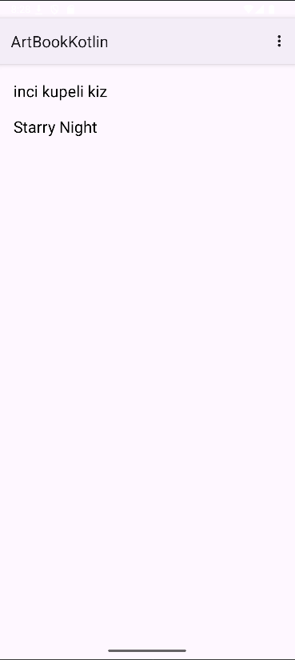
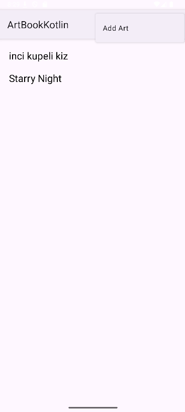
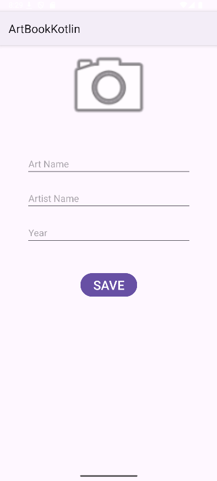
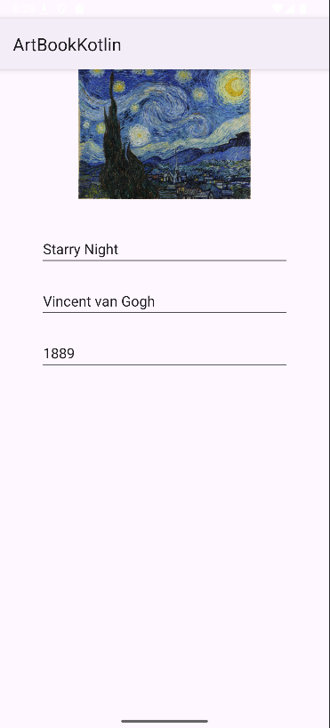
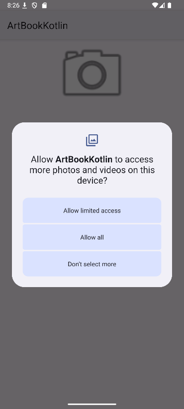

## 🎨 ArtBook

ArtBook, kullanıcıların kişisel sanat koleksiyonlarını keşfetmelerine, kaydetmelerine ve yönetmelerine olanak sağlayan Kotlin tabanlı bir Android uygulamasıdır. Kullanıcılar, eserlerin resimlerini, adını, sanatçısını ve yapım yılını ekleyebilir ve bu bilgileri düzenli bir listede görüntüleyebilir.

## 🌟 Özellikler

Yeni Eser Ekleme: Kolayca resim, eser adı, sanatçı ve yıl bilgilerini girerek yeni eser ekleyebilirsiniz.

Eser Galerisi: Kaydedilmiş tüm eserleri ana sayfada kaydırılabilir bir liste halinde görüntüleyin.

Detay Görünümü: Listedeki herhangi bir esere dokunarak eserin tam detaylarını görüntüleyin.

Görsel Optimizasyonu: Seçilen resimler otomatik olarak yeniden boyutlandırılarak veritabanında verimli şekilde saklanır.

İzin Yönetimi: Android’in farklı sürümlerinde galeriden resim erişimi için gerekli izinleri yönetir.

## 📸 Ekran Görüntüleri

| Liste Görünümü | Add Art | Ekleme Sayfası |
|----------------|---------|----------------|
|  |  |  |

| Detay Sayfası | İzinler |
|---------------|---------|
|  |  |

## 🛠 Uygulamanın Çalışma Mantığı

Veritabanı: Eser bilgilerini SQLite veritabanında saklar, resimleri BLOB olarak tutar.

RecyclerView: Kaydedilmiş eserleri kaydırılabilir ve verimli bir şekilde gösterir.

View Binding: Layout ve UI güncellemelerini kolaylaştırır.

İzinler: Android 13 ve alt sürümler için gerekli izinleri sorunsuz yönetir.

## ⚙️ Teknolojiler

Kotlin – Ana programlama dili

Android SDK – Mobil platform geliştirme

SQLite – Hafif veritabanı çözümü

RecyclerView & ViewBinding – Dinamik ve sorunsuz kullanıcı arayüzü

## 🎯 Gelecek Planları

🔎 Arama ve Filtreleme: Eserleri isim, sanatçı veya yıl ile filtreleyebilme.

☁️ Bulut Senkronizasyonu: Verileri bulutta saklayarak cihazlar arası eşleme.

👤 Kullanıcı Girişi: Kişisel koleksiyonları kullanıcı hesabına bağlama.

✨ Animasyon ve UI Geliştirmeleri: Daha interaktif ve modern bir kullanıcı deneyimi.

## - **Demo GIF**

  

